# New Entitlement Tool Setup Guide

BY <guangli2@cisco.com>                                                    PUBLISHED: SEP 05, 2022

---

New Entitlement Tool is a tool to compare the SN of SRs and show inventory to check if the SN is matching with show inventory information.

New Entitlement Tool which developed by python 3.x

## 1. Setup a New Entitlement Tool

To use New Entitlement Tool,prerequisite

### 1.1 Prerequisite

Download and Install Python 3.8 ,PyCharm Community ,Please select proper versions based on your OS (Window/macOS/Linux)

1. [Python 3.8](https://www.python.org/downloads/)

2. [PyCharm Community](https://www.jetbrains.com/products/compare/?product=pycharm&product=pycharm-ce)

   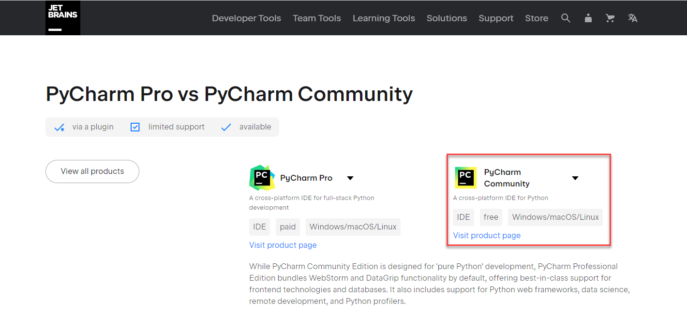 


### 1.2 Configure a New Entitlement Tool

Import a New Entitlement Tool

1. unzip the **TACENT-master.zip**(a New Entitlement Tool)

2. import a New Entitlement Tool to PyCharm Community

   File -> Open -> Find  TACENT-master Directory

   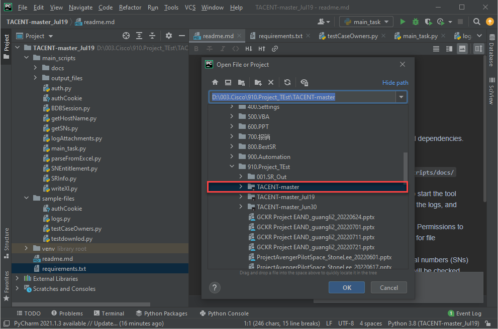 

   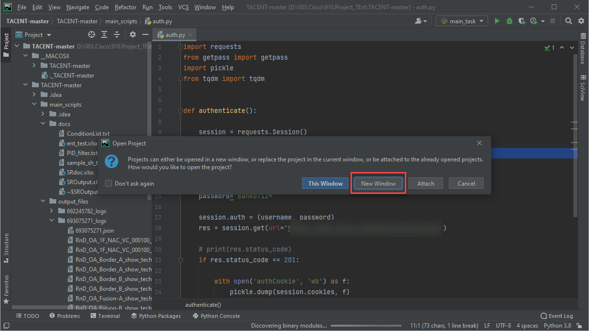  

3. Configure Python Interpreter & Package requirements

   1. Configure Python Interpreter 

      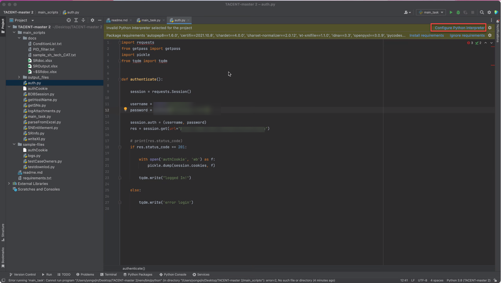     

      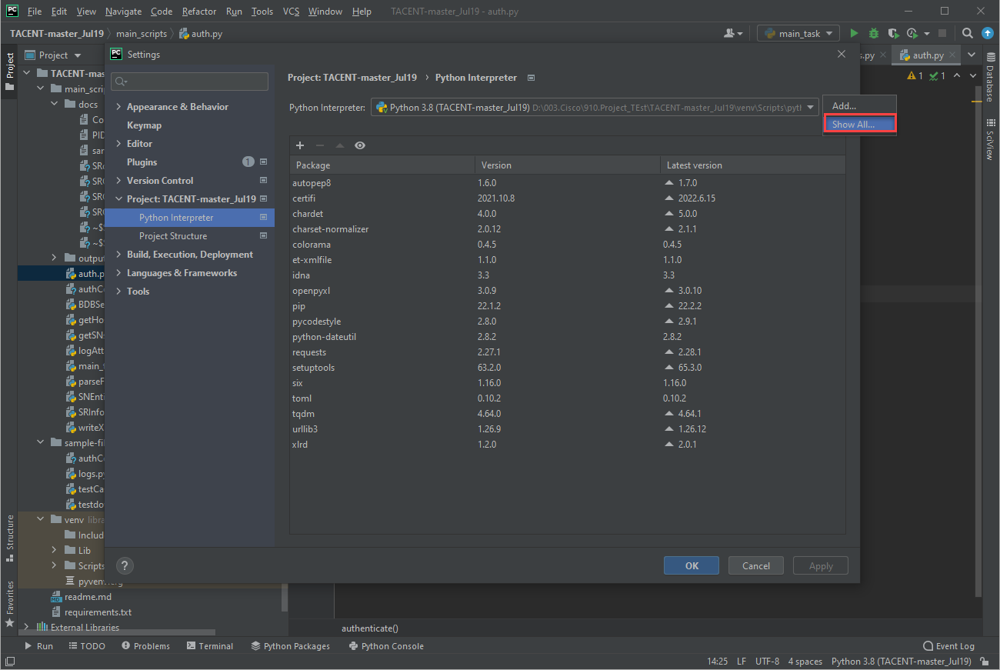 

      Find the path of Python Interpreter which you installed

      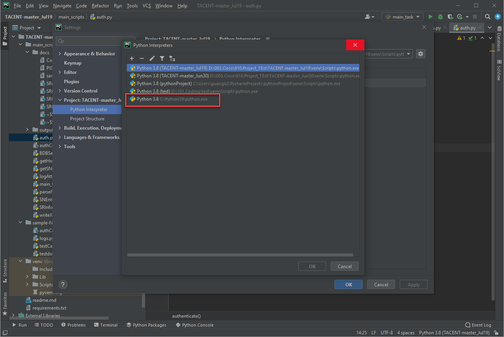

   2. Configure Package requirements

      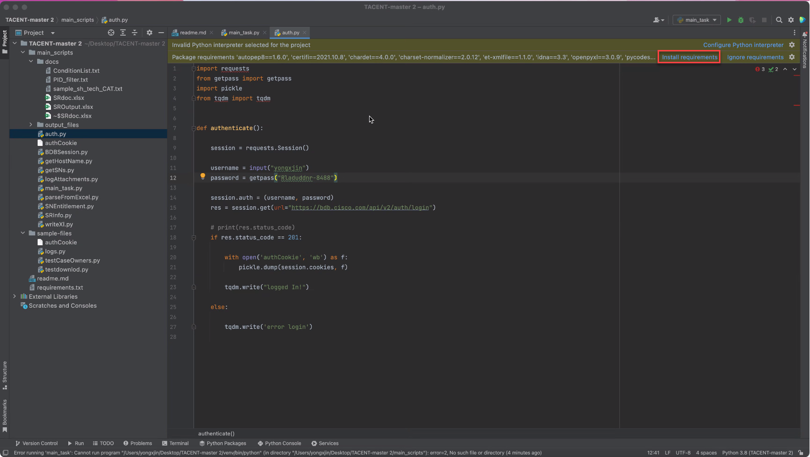  

      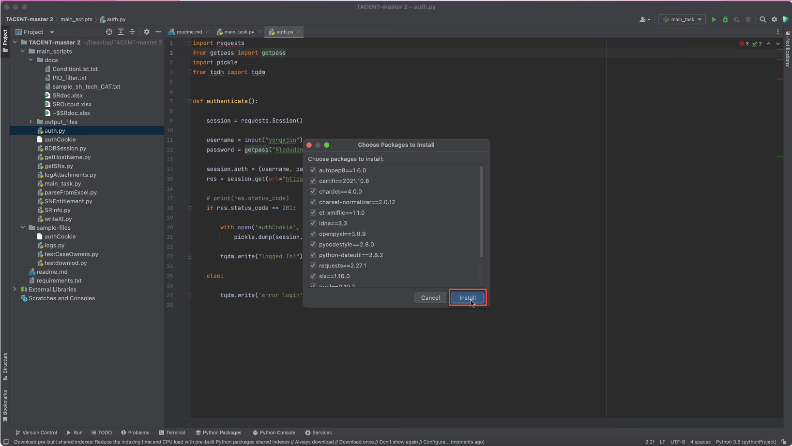 

      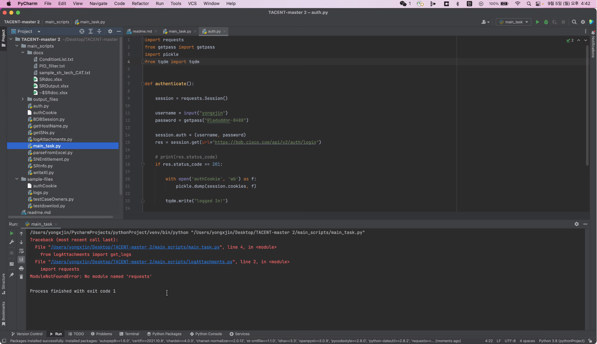

      Wait until Packages installed successfully

      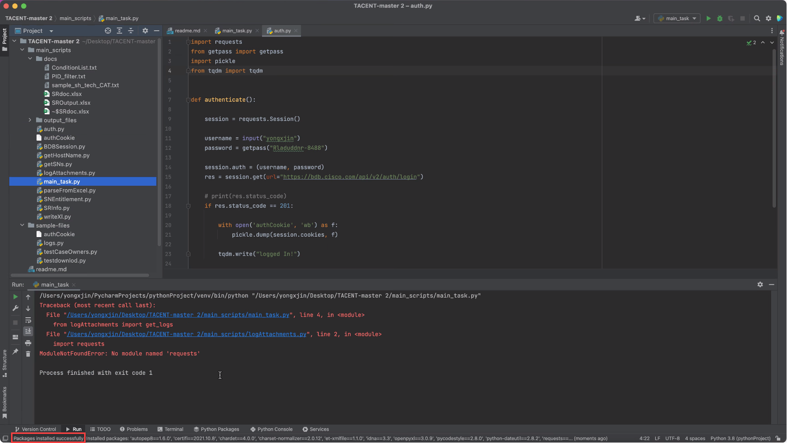

4. Open a TACENT-master/main_scripts/auth.py to modify the source for **username,password**

   ```python
   ==> Before
   
       username = input("CCO id: ")
       password = getpass("Password: ")
       
   ==> After
   
       username='guangli2'
       password='Bank8888*'
   ```

   Original Source

   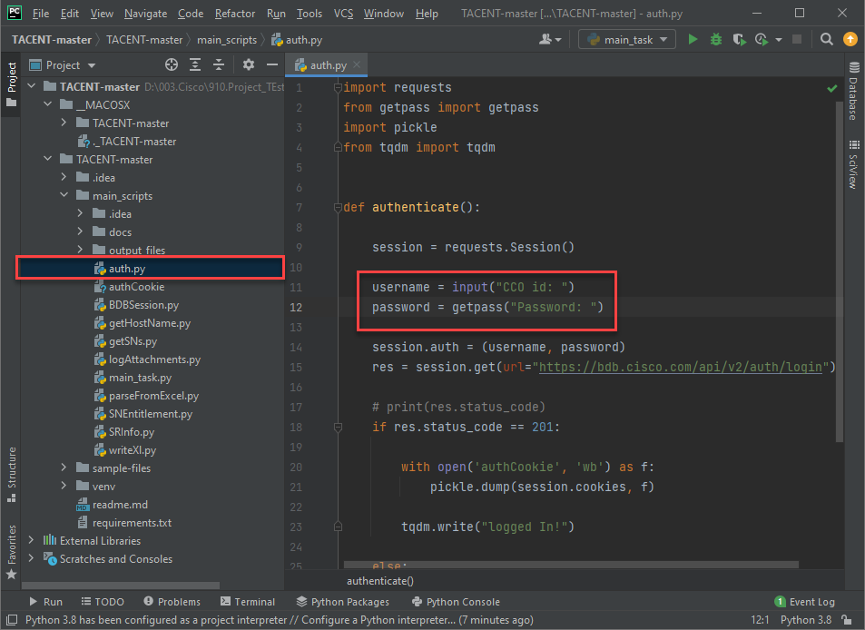 

   Update 

   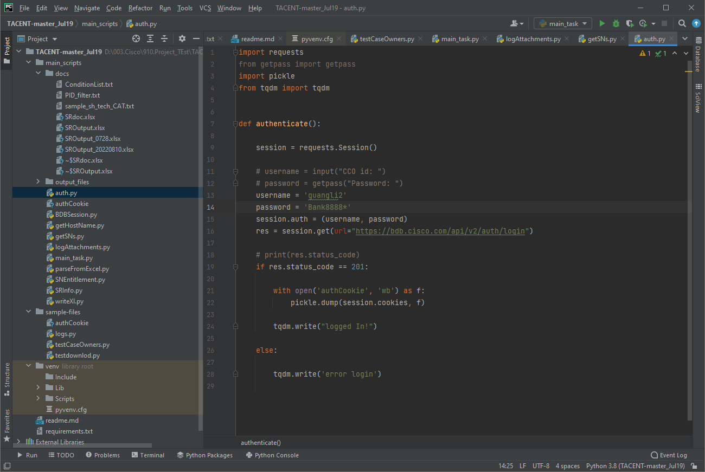 


## 2. Run a New Entitlement Tool

1. To run a New Entitlement Tool,Please open a input file(**main_scripts/docs/SRdoc.xlsx**) to fill SR

   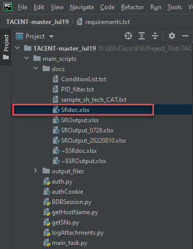 

   

2. Run main_task.py(**main_scripts/main_task.py**)

   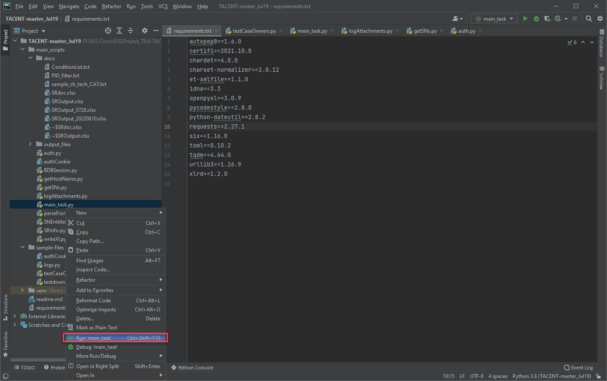 

   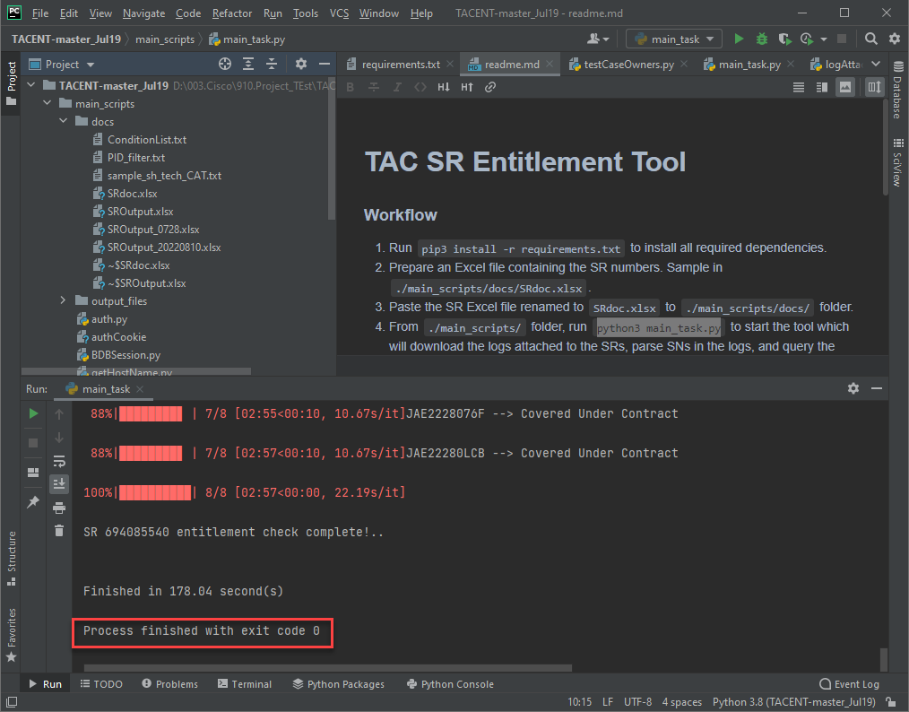 

   

   

     

   

3. Review the Output excel file(**main_scripts/docs/SROutput.xlsx**)

     

 

