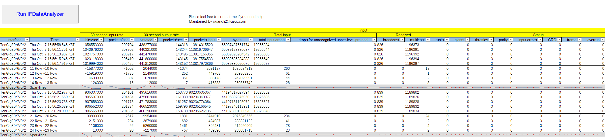

# My Cisco Tools

These are MS Excel VBA Tools to improve performance.

The Tools will be increased 

## 1. PTP Badtimestamp Analyzer

PTP Badtimestamp Analyzer is used to analysis PTP timestamp offset in IOS-XR.

If there are PTP Badtimestamps,the tools will be filter them 

 

 

## 2. IP Factory

IP Factory is used to create IP Configuration on IOS-XR/IOS-XE.

It is used by test the device.

 

## 3. Interface Analyzer

Interface Analyzer is used to analyze **"show interfaces"** result on IOS-XR.

It is used to analyze the input/output drops .

---

The Tools are developed and maintained by Stone. Please contact <comebackhome@163.com> if you need help or bugs

